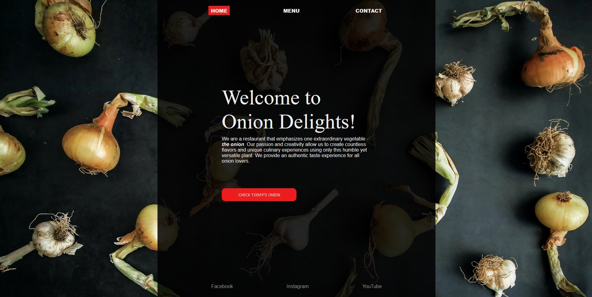

# Odin-Project-Webpack-Restaurant-Webpage

# General Info

Simple restaurant webpage project developed with npm, babel, webpack, ES6 modules.

# Features

--

# Technologies

Build with:

- HTML
- CSS(Sass)
- Vanilla Javascript

#

- Webpage build with using ES6 modules
- Bundled by Webpack
- Transpiled by Babel
- JS packages and dependencies managed with npm

# Inspirations & Resources

The Odin Project project assumptions: https://www.theodinproject.com/lessons/node-path-javascript-restaurant-page
Webpack tutorials on YouTube:

- https://www.youtube.com/watch?v=IZGNcSuwBZs
- https://www.youtube.com/watch?v=MpGLUVbqoYQ&t=10s
- https://www.youtube.com/watch?v=TOb1c39m64A

# Status

Completed

# Conclusions & Issues

- Small project but fully loaded of new and really helpful elements like webpack, ES6 modules. Webpack.config.js created with YT tutorial - need to study more how to manage modules, plugins, etc.
- Styles could be in one file only but wanted to test @use rule in sass and how it behaves during webpack bundling.

#

- GH Page created with different branch as it's shown: https://gist.github.com/cobyism/4730490
